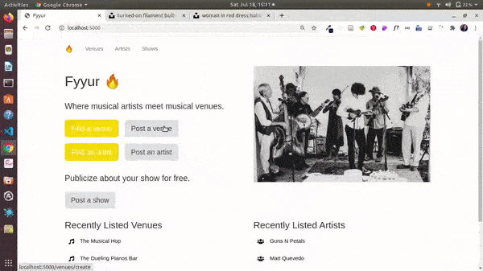

## Fyyur (Musicians app)

### Introduction

Fyyur is a musical venue and artist booking site that facilitates the discovery and bookings of shows between local performing artists and venues. This site lets you list new artists and venues, discover them, and list shows with artists as a venue owner.

This project involved building out the data models to power the API endpoints for the Fyyur site by connecting to a PostgreSQL database for storing, querying, and creating information about artists and venues on Fyyur.

### Overview

Fyyur is a platform that artists and musical venues can use to find each other, and discover new music shows. This site that is capable of doing the following using a PostgreSQL database:

- creating new venues, artists, and creating new shows.
- searching for venues and artists.
- learning more about a specific artist or venue.

### Demo



### Tech Stack

- **SQLAlchemy ORM** - ORM library of choice
- **PostgreSQL** - database of choice
- **Python3** and **Flask** - server language and server framework
- **Flask-Migrate** - for creating and running schema migrations
- **HTML**, **CSS**, and **Javascript** with [Bootstrap 3](https://getbootstrap.com/docs/3.4/customize/) - for website's frontend

### Main Files: Project Structure

```sh
├── README.md
├── app.py *** the main driver of the app. Includes SQLAlchemy models.
                  "python app.py" to run after installing dependences
├── config.py *** Database URLs, CSRF generation, etc
├── error.log
├── forms.py *** Your forms
├── requirements.txt *** The dependencies to be installed with "pip3 install -r requirements.txt"
├── static
│   ├── css
│   ├── font
│   ├── ico
│   ├── img
│   └── js
└── templates
    ├── errors
    ├── forms
    ├── layouts
    └── pages
```

Overall:

- Models are located in the `MODELS` section of `app.py`.
- Controllers are also located in `app.py`.
- The web frontend is located in `templates/`, which builds static assets deployed to the web server at `static/`.
- Web forms for creating data are located in `form.py`

Highlight folders:

- `templates/pages` -- Defines the pages that are rendered to the site. These templates render views based on data passed into the template’s view, in the controllers defined in `app.py`.
- `templates/layouts` -- Defines the layout that a page can be contained in to define footer and header code for a given page.
- `templates/forms` -- Defines the forms used to create new artists, shows, and venues.
- `app.py` -- Defines routes that match the user’s URL, and controllers which handle data and renders views to the user. This is the main file you will be working on to connect to and manipulate the database and render views with data to the user, based on the URL.
- Models in `app.py` -- Defines the data models that set up the database tables.
- `config.py` -- Stores configuration variables and instructions, separate from the main application code.

### Development Setup

First, [clone the app](https://github.com/uadam12/fyyur.git) and run the following commands if you haven't already.

```
$ cd fyyur
$ python -m venv venv
$ source venv/bin/activate
$ pip install -r requirements.txt
$ flask db init
$ flask db migrate
$ flask db upgrade
```

To start and run the local development server,

```
$ export FLASK_APP=app
$ export FLASK_ENV=development # enables debug mode
$ flask run
```

Then, navigate to Home page [http://localhost:5000](http://localhost:5000)
